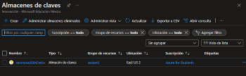
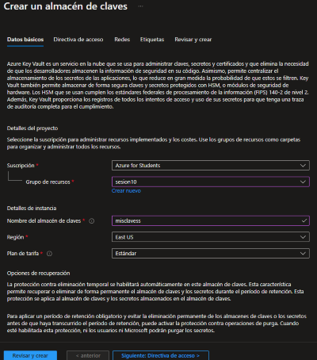
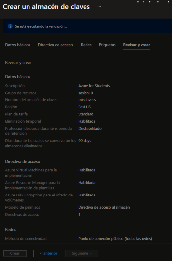
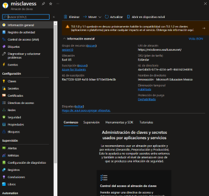
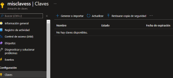
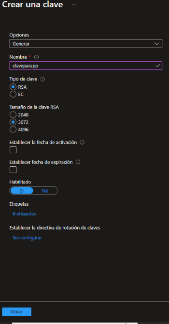
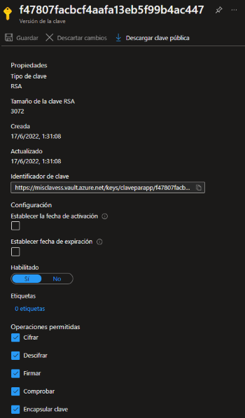
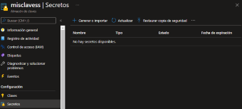
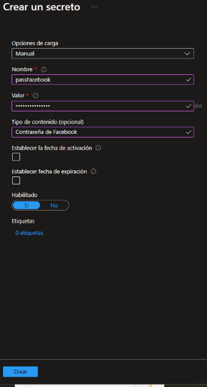
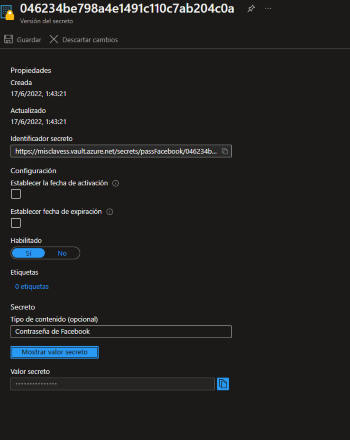

## Azure Key Vault

Es un almacen de llaves.

Guarda contraseñas, claves, cetificados e incluso dispositivos de hardware con criptografia.

- **Modelo de servicio:** SaaS.
- **Funcion:** Administra los secretos.
- **Funcion:** Asministra claves de cifrado.
- **Funcion:** Administra cetificados SSL.
- **Funcion:** Supervision y control de acceso.
- **Funcion:** Almacena secretos respaldados por modulos de seguridad de hardware HSM.

Hay dos tipos de cifrado :

- **Cifrado simetrico**
- **Cifrado asimetrico**

El cifrado simetrico es que solo tu tienes un key.

El cifrado asimetrico es cuando tenemos una clave publica, que esa si la mandamos pero tiene que hacer match
con la clave privada que este en nuestro equipo o que este en el servidor y esa no la mandamos por ningun motivo

**Cifrar las cosas es cambiarlas de lugar con un algoritmo** 

--------------------------------------------------------------------------------

## Pasos para crear una Key Vault

1.- Abrimos el [Portal de Azure](portal.azure.com)

2.- Buscamos Almacenes de claves **(key volt)**.

3.- Le damos en crear y ponemos los datos.

4.- Nos vamos a Directiva de acceso y habilitamos todo.

**Nota: Para hacer los discos de encriptado lo primero que se debe hacer es crear los disco y luego el almacen de claves (key volt)**

5.- Le damos en revisar y crear.

6.- Ahora le damos en ir al recurso.

7.- Nos vamos a la seccion de claves. Y le damos en generar o importar.

8.- Le ponemos en Generar, le damos un nombre, tamaño mientras mas grande mejor. Y le damos crear.

9.- Cuando se cree, le damos click, donde podremos ver una clave de encriptacion echa por Azure. Tambien podemos descargar la clave.

10.- Si nos vamos a la seccion de secretos, ahi podemos guadar nuestras contraseñas.

 

11.- Vamos a generar un secreto, anotamos los datos de nuestro secreto y le damos crear.

**Aca podemos guadar de manera segura**.

12.- Le damos click al nombre del Secreto y nos llevara a donde podremos ver nuestro valor secreto.

13.- Listo esto es el Azure Key Volt

-------------------------------------------------------------------------------
